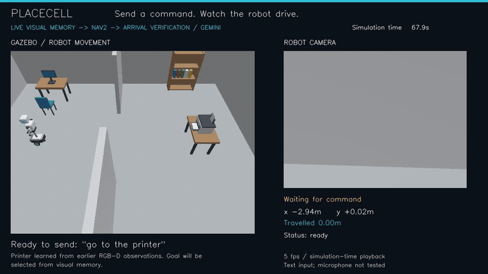
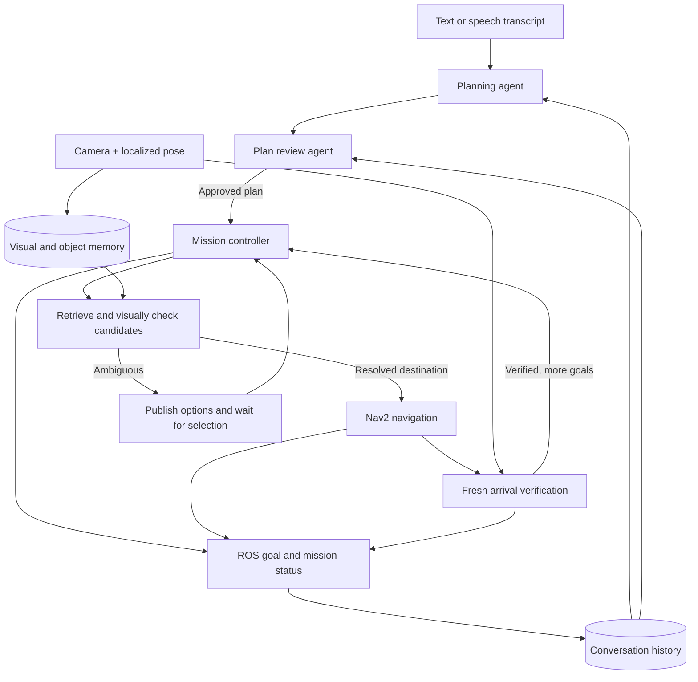

# PlaceCell

**Multi-agent mission planning, visual memory, and navigation for mobile robots.**

Give a robot a destination—or a sequence of destinations—in natural language. PlaceCell
interprets the instruction, finds relevant visual memories, checks the candidate images,
and sends grounded goals to Nav2. It reports progress over ROS 2 and retains conversation
context for follow-up requests while continuing to learn from camera observations.

> “Go to the printer, then visit the cupboard.”

The Python core also works with recorded observations, without ROS or a physical robot.
Typed text and completed speech transcripts share the navigation interface.

**Status: pre-alpha.** Agent-planned missions are experimental and opt-in. The repository
includes a recorded single-goal Gazebo demonstration and automated regression tests;
real-model mission accuracy and hardware reliability still need evaluation.

[Quickstart](#quickstart) · [Robot setup](docs/navigation.md) ·
[Agent missions](docs/missions.md) · [Simulation](docs/simulation.md) ·
[Roadmap](docs/roadmap.md)

## Demo

[](docs/assets/wheeled_humanoid_printer.mp4)

**[Watch the 49-second Gazebo demonstration](docs/assets/wheeled_humanoid_printer.mp4).**
The command `go to the printer` retrieves an object from visual memory, drives the robot
3.98 m to a checked approach pose, and verifies the printer on arrival. Subsequent camera
observations update the same object's memory.

This recording uses a published text command and simulation-time playback. It demonstrates
a single destination; chained missions, microphone input, and manipulation are not shown.
See the [simulation guide and recorded results](docs/simulation.md) to reproduce it.

## Capabilities

- **Single and chained instructions.** An optional planning agent proposes ordered visits;
  a separate review agent checks the plan against the request and recent conversation.
- **Image and caption retrieval.** Store separate embeddings for pixels and descriptions,
  and search by meaning, observation time, or map position.
- **Visual destination checks.** Inspect retrieved images before departure and fresh
  camera evidence after arrival. Multiple plausible matches require clarification.
- **Object memory.** Optional RGB-D tracking retains object IDs, cropped views, measured
  positions, and evidence of movement or disappearance.
- **Memory maintenance.** Reinforce revisited places, apply operator corrections, refine
  captions, consolidate observations, and expire stale memories.
- **Conversation and progress.** Persist accepted prompts and mission outcomes, and
  publish the current goal, mission step, navigation state, and remaining distance.
- **Robot-independent development.** Use the Python API with recorded data, run the
  bundled Gazebo environment, or connect an existing ROS 2/Nav2 robot.

PlaceCell is designed around three practical goals: interchangeable model providers,
storage that runs in process, and a core that can be developed and evaluated without a
robot. Available adapters include compatible chat/vision endpoints, hosted multimodal
embeddings, optional local CLIP embeddings, and in-memory or persistent storage.

## Architecture

The agent-enabled path for destinations retrieved from visual memory is:



Models interpret intent and inspect evidence. The controller owns goal order, localization
checks, deadlines, and cancellation; models do not invent executable coordinates or declare
arrival. Each subsequent goal is resolved against current memory when its turn begins.

For memory destinations, reaching a pose alone does not complete the step: fresh visual
evidence must also match. A failed or unverified step ends the sequence without skipping
ahead. Configured named places retain their existing Nav2 completion semantics. With
mission mode disabled, the explicit single-destination command interface remains available.

Camera ingestion runs independently throughout the mission. Visual memory records what
the robot observed; conversation history records what the user requested and what happened.
See [missions](docs/missions.md) for the agent contracts and
[the perception diagram](docs/assets/architecture.svg) for the underlying visual pipeline.

## Quickstart

### Install from source

Requires **Python 3.10 or newer**. The package has not been published to PyPI.

```bash
git clone https://github.com/sabeeh-saad/placecell.git
cd placecell
python3 -m venv .venv
source .venv/bin/activate
python -m pip install -e .
```

Add the extras needed for your deployment from the repository directory:

```bash
python -m pip install -e '.[video,lancedb,objects]'
```

`video` adds frame extraction, `lancedb` adds persistent storage, and `objects` adds image
crop support. Optional `clip` and `speech` extras enable local image embeddings and
microphone transcription. For ROS 2, use the Python interpreter matching your sourced ROS
distribution and a virtual environment with `--system-site-packages`; follow the
[robot setup guide](docs/navigation.md) for the complete configuration.

### Run a minimal memory example

This example runs locally with no API key, image files, or robot. It stores a synthetic
caption and exercises the retrieval API. `HashingEmbedder` is a deterministic development
backend; this example does not demonstrate visual understanding or navigation.

```python
import time

from placecell import CollectionInfo, InMemoryStore, Memory, Pose, Recall
from placecell.providers import HashingEmbedder

embedder = HashingEmbedder()
store = InMemoryStore(CollectionInfo("demo", embedder.model_name, embedder.dimension))

memory = Memory.create(
    robot_id="demo-robot",
    camera_id="front",
    timestamp=time.time(),
    pose=Pose(2.0, 1.0, map_id="office"),
    caption="A red printer beside the window",
)
memory = memory.with_embedding(
    embedder.embed_text([memory.caption])[0], embedder.model_name, kind="caption"
)
store.upsert([memory])

for hit in Recall(store, embedder).similar("red printer", k=1):
    print(hit.memory.caption)
    print(f"Observed from x={hit.memory.pose.x}, y={hit.memory.pose.y}")

store.close()
```

For real observations, use `Ingester` with a camera or recorded frames, stamped poses,
and suitable embedding/captioning providers. Start with the
[image and caption retrieval guide](docs/multimodal.md).

### Try the simulator

On a Linux host with Docker, the bundled office environment provides RGB-D, lidar,
localization, and Nav2:

```bash
./simulation/sim build
./simulation/sim start-nav
./simulation/sim check-nav
```

These navigation checks require no model API key. The separate visual-memory pipeline
test uses hosted models. See [simulation setup](docs/simulation.md) for prerequisites,
provider configuration, and recording a run.

## ROS 2 interface

The reference navigation integration requires an existing Nav2 stack, a known map,
timestamped camera poses, and recent localization estimates. Enable navigation using
the [navigation guide](docs/navigation.md). For natural single or chained requests,
also enable `mission_enabled` and configure a tool-calling model as described in
[agent missions](docs/missions.md).

Once the node is configured, monitor feedback in one terminal:

```bash
ros2 topic echo /placecell/navigation_status
```

Send a mission from another terminal:

```bash
ros2 topic pub --once /placecell/command std_msgs/msg/String \
  "{data: 'First go to the printer, then visit the cupboard'}"
```

Use the same topic for a destination selection or cancellation:

```bash
ros2 topic pub --once /placecell/command std_msgs/msg/String "{data: 'option two'}"
ros2 topic pub --once /placecell/command std_msgs/msg/String "{data: 'stop'}"
```

Stop requests bypass model calls and prevent remaining mission steps from starting.
Speech-to-text systems can publish completed transcripts to the same command topic.

`/placecell/navigation_status` publishes JSON in `std_msgs/String`. Feedback includes:

- `mission_id`, `mission_step`, and `mission_destinations` for sequence progress.
- `request_id` for the current step and `state` for planning, navigation, verification,
  ambiguity, or a terminal outcome.
- `destination`, `choices`, and `distance_remaining` when available.

An intermediate visit emits `step_succeeded`; the last successful visit emits `succeeded`.
The topic is a live event stream. [Mission documentation](docs/missions.md#goal-feedback)
describes the fields and failure behavior.

Questions use `/placecell/ask`, with answers and retrieved evidence on `/placecell/answer`.
Corrections and caption rechecks use `/placecell/correct` and `/placecell/refine`.

## Memory and context

Visual memories retain evidence references, timestamps, map poses, captions, and embedding
vectors. Optional object memory adds persistent identities and RGB-D geometry. Repeated
observations can reinforce a memory; corrections, changed evidence, and retention policies
affect future retrieval. Ranking weights and visual verdicts are evidence, not calibrated
probabilities or guarantees of identity.

Persistent collections keep authoritative state in SQLite and a derived vector index in
LanceDB. Mission mode stores conversation history separately, scoped by robot, map, and
conversation ID. Agents receive a bounded recent context window. Restarting preserves
history without automatically replaying movement.

See [memory operations](docs/operations.md) for retention, upgrades, and recovery, and
[memory refinement](docs/refinement.md) for caption revisions and rollback.

## Documentation

- [Navigation and speech](docs/navigation.md): robot prerequisites, commands, and arrival checks.
- [Agent missions](docs/missions.md): planning, review, conversation context, and ROS feedback.
- [Image and caption retrieval](docs/multimodal.md): providers, re-embedding, and retrieval evaluation.
- [Object memory](docs/objects.md): instance association and RGB-D change tracking.
- [Object approach planning](docs/approach.md): selecting checked stopping poses near objects.
- [Arrival verification and search](docs/object-arrival.md): fresh evidence and bounded viewpoint search.
- [Object evaluation](docs/object-evaluation.md): replaying labelled RGB-D recordings.
- [Gazebo simulation](docs/simulation.md): setup, recorded results, and demonstrations.
- [Memory operations](docs/operations.md) and [refinement](docs/refinement.md): persistence and maintenance.
- [Roadmap](docs/roadmap.md) and [changelog](CHANGELOG.md): planned work and change history.

## Current scope

- **Mapped environments.** Navigation requires external localization and a known, versioned
  map. PlaceCell does not currently provide visual SLAM or unrestricted exploration.
- **Text and speech transcripts.** Reference-image instructions, gestures, conditional
  missions, manipulation, and conversational editing during motion remain outside the
  current mission interface.
- **Evidence can be ambiguous.** Saved images cannot prove that a remote object is still
  present. Lookalikes, occlusion, stale observations, and model errors require evaluation;
  the system can return an unverified outcome.
- **Deployment-specific validation.** Regression tests exercise controlled models and
  transport. The recorded Gazebo run demonstrates a bounded scenario. Neither establishes
  state-of-the-art accuracy, hardware endurance, or general mission reliability.

## Development and contributions

From the repository root, install the development dependencies and run the CI checks:

```bash
python -m pip install -e '.[dev,video,lancedb]'
ruff check .
ruff format --check .
mypy
pytest --cov
```

CI runs on Python 3.10, 3.11, and 3.12 with a 90% coverage requirement. Contributions are
welcome in evaluation datasets, failure-case reproductions, model adapters, robot
integrations, and documentation. Include relevant tests and the evidence supporting any
accuracy or performance claim. Use the [roadmap](docs/roadmap.md) to identify current priorities.

The core lives in `src/placecell/`: `missions.py` and `mission_context.py` handle agent
planning and conversation history; `navigation.py` owns execution; `objects.py`,
`object_arrival.py`, and `object_search.py` handle instance memory and verification;
`providers/`, `store/`, and `ros2/` supply the integration boundaries.

## Acknowledgements

[NVIDIA's ReMEmbR](https://github.com/NVIDIA-AI-IOT/remembr) was an inspiration for
PlaceCell's work on language-queryable robot memory.

## License

[Apache-2.0](LICENSE).
