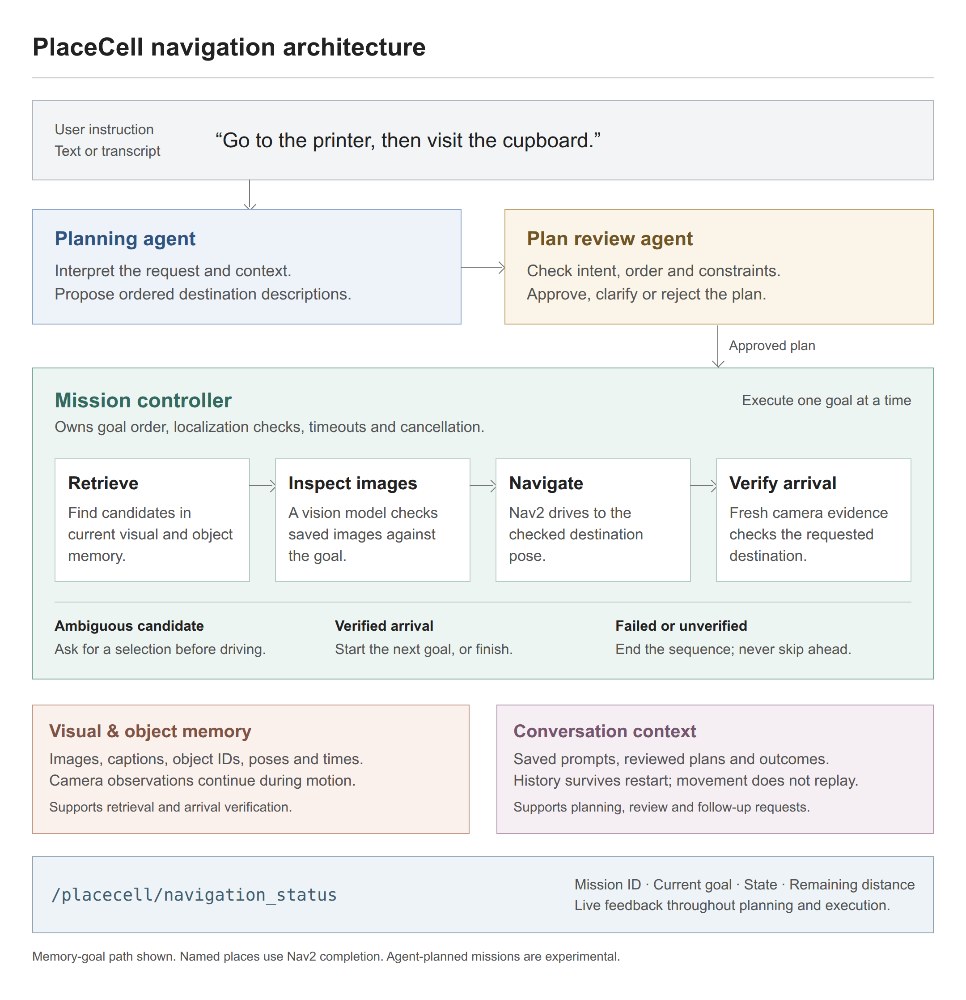

# Conversational navigation missions

PlaceCell's direction is a robot that accepts natural instructions, visits one or several
destinations in order, keeps the conversation context and exposes each goal's progress.
This first implementation adds an opt-in multi-agent interpretation path to the existing
navigation controller. It is experimental: automated tests exercise scripted model replies
and simulated transport, not real-model language accuracy or live robot reliability.

## Agents and execution

Use the [mission evaluation guide](mission-evaluation.md) for labelled cases and repeatable
plan/outcome scoring. Its scripted baseline checks software contracts; live-model mission
accuracy and visual grounding remain separate evaluations.

[](assets/mission-architecture.png)

[View full-size diagram](assets/mission-architecture.png) · [Editable HTML source](assets/mission-architecture.html)

- The **planning agent** interprets the complete instruction and proposes an ordered list
  of destination descriptions. It does not split sentences on `then`, and destination
  names are not coded into the planner.
- The **plan review agent** sees the original instruction, proposed destinations and
  recent context in a separate model conversation. It can approve, reject or ask for
  clarification. A proposal cannot move the robot without this review.
- The existing **visual verifier** examines retrieved pixels for each destination and
  checks fresh evidence after arrival. Object goals additionally use instance verification.
- The **mission controller** is ordinary code. It owns ordering, deadlines, grounding,
  cancellation and status. Retrieval and Nav2 remain tools/services; they are not relabelled
  as autonomous agents. Models cannot send arbitrary coordinates or declare that the
  robot has arrived.

The first version supports ordered visits, including repeated visits. A model can interpret
varied phrasing, but its output must fit a validated capability schema. Conditional plans,
loops, manipulation and scheduled actions are unsupported and must be clarified or rejected.
This boundary is intentional: flexible language does not grant capabilities the robot lacks.
Both agents may use the same model or different tool-calling models. Separate contexts are
not proof of independent errors, and a reviewer can also approve an incorrect interpretation.

Both roles receive the names of configured places in the current map, without coordinates.
This resolves a configured `home`; it is not an inventory or whitelist of object destinations.
Unlisted object names and functional descriptions are grounded by the executor after review.
The catalog cannot add visits, waive image checks, or turn an absent target into a success.

## Enable the ROS interface

For the bundled Gazebo office, the [reference deployment guide](reference-deployment.md)
provides an explicit model configuration and `simulation/sim missions` launcher. That
profile loads after the existing perception configuration and uses a 30-second timeout
per planning/review call; the library defaults described below remain unchanged.

Keep the camera, localization, map and verification configuration in the
[navigation guide](navigation.md). Add these parameters to `placecell-ros2`:

```bash
-p mission_enabled:=true \
-p mission_model:="$MISSION_MODEL" \
-p mission_base_url:="$MISSION_URL" \
-p mission_context_path:=/absolute/path/missions.sqlite3 \
-p mission_conversation_id:=operator-session
```

`MISSION_MODEL` must identify a model with function/tool calling. The endpoint uses the
existing chat provider interface and `PLACECELL_API_KEY` (or `api_key_env`). The review
defaults to the same model/endpoint; `mission_review_model` and `mission_review_base_url`
can select another. An empty mission URL uses `chat_base_url`. Planning and review each
have an eight-second provider timeout and no automatic retries; the overall existing
`navigation_lookup_timeout_s` also bounds planning. `mission_max_destinations` defaults
to eight, configurable from one to twenty. Plain prose, malformed output, extra fields,
over-limit plans, interrupted completions and provider errors cannot start a mission.

Both typed requests and completed speech transcripts enter the same topic:

```bash
ros2 topic pub --once /placecell/command std_msgs/msg/String \
  "{data: 'First go to the printer, then visit the cupboard'}"
ros2 topic echo /placecell/navigation_status
```

Single destinations use the same agent path when enabled. `stop`, `cancel navigation`
and numbered destination choices retain a direct path that does not depend on a model
response. Stop cancels the current activity and prevents all remaining visits; a late
planning, review or arrival result cannot restart it. During motion, ownership is retained
until Nav2 confirms a terminal result. Commands are rejected as busy while a trip is active.
Emergency stopping still belongs to the robot's own safety system.

With mission mode disabled, the existing explicit single-destination grammar is unchanged.
Image instructions, gestures and raw audio are not accepted by the mission topic yet.
An external speech-to-text adapter can provide text today; other modalities need grounded
input adapters. Natural-language coordinate interpretation is not supported in mission mode.

## Goal feedback

The existing `std_msgs/String` JSON status keeps `request_id`, `state`, `message`,
`destination`, `choices`, `distance_remaining`, `object_result` and `search_attempt`.
It adds:

- `mission_id`: the stable ID across the entire requested sequence.
- `mission_step`: the current one-based goal index; zero while planning.
- `mission_destinations`: the reviewed ordered descriptions.

Each step has its own `request_id`, also separating late feedback from previous goals.

For persistent diagnostic evidence beyond live status, enable [mission tracing](mission-tracing.md).
It links these IDs to planning/review, retrieval candidates, visual checks and action results,
with stage durations and reported provider usage. The reference mission profile enables it;
export a report by mission ID after a failure or before removing the simulation container.
The current destination includes its map pose, target, memory/object IDs and source.
Subscribers can combine the goal index and destination list to display pending goals.
For example, an abbreviated event during the second goal is:

```json
{
  "mission_id": "example-mission",
  "request_id": "example-second-goal",
  "mission_step": 2,
  "mission_destinations": ["printer", "cupboard"],
  "state": "navigating",
  "distance_remaining": 2.1
}
```

New states are `planning`, `planned`, `clarification_required` and `step_succeeded`.
`step_succeeded` completes an intermediate visit; only the last visit produces mission
`succeeded`. Existing resolution, motion, arrival and failure states continue to apply.
This topic remains a live event stream. Reconnecting clients can read
`/placecell/get_mission_snapshot` or subscribe to the retained `/placecell/mission_snapshot`
topic without replaying a command. The [operator interface](operator-interface.md) specifies
the versioned JSON command/status payloads, snapshot fields and delivery semantics.

Each next goal is resolved against current memory when its turn begins. An earlier lookup
is not reused throughout a long mission. Memory goals advance only after fresh arrival
verification. Configured named places retain their existing Nav2 completion semantics;
they do not claim visual identity. Failure, missing evidence or an unverified arrival ends
the sequence without silently skipping a goal. Multiple candidates pause it for `option one`,
`option two` or `option three`; the remaining sequence is retained. An expired choice ends
the mission. A language-level clarification returns without a pending executable plan;
the next full instruction is interpreted using recent history. Mid-mission conversational
editing and automatic failure replanning remain future work.

## Conversation context

Accepted instructions, destination choices, stops, reviewed destination lists and status
transitions are stored in SQLite. Frequent identical motion feedback is not appended on
every distance update. ROS defaults to `~/.placecell/missions.sqlite3`; set an empty
`mission_context_path` for memory-only history. Set `mission_conversation_id` to isolate
operators/sessions. The node also scopes history by `robot_id` and `map_id`.

Planning and review receive up to twenty recent history events within a 16,000-character
serialized context budget, with timestamps and
actual outcomes. They can use them to interpret follow-ups such as "take me there again";
the destination must still be retrieved and verified now. Missing or ambiguous references
should prompt clarification. Persistent history now has row, content and age limits:
1,000 events, 2 MiB and 30 days by default, across all scopes sharing that database.
Pruning removes whole requests and exposes a history boundary. Deleted or superseded
scene/object references remove their request and older events from the planning window;
an older destination is never substituted for an unavailable latest reference. Both
agents are told to clarify when required context is missing. See the
[retention contract](memory-retention.md) for settings, failures and measured checks.
Text history remains separate from image/object memory and does not rewrite it.

Restarting loads context only. It never resumes movement or replays unfinished steps.
A new instruction is always needed. History is untrusted context, not executable work.
If persistence fails, new motion is blocked and an active mission requests cancellation
on its next poll; failure to write history never prevents a stop request.

The Python API exposes `MissionPlanner`, `PlanReviewAgent` and `MissionContext`; inject
the planner and context into `NavigationCommands`. Without an explicit context, an
agent-enabled controller keeps an in-memory history for its lifetime.

## Validation still needed

Deterministic tests cover schema rejection, reviewer veto, ordered execution, ambiguity,
fresh arrival gating, timeout/cancellation races, duplicate callbacks, context persistence
and scope isolation. They do not demonstrate language understanding or perception quality.
Evaluate held-out paraphrases, negations, prompt injection, multi-turn references, changed
objects and real ROS navigation before treating this as a reliable deployment. Measure
complete-mission success, wrong-goal motion, correct abstention, latency and model cost.
