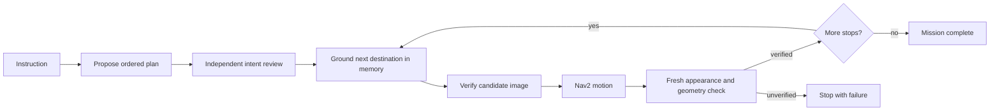

# Multi-product Gazebo missions — 22 September 2026

The product scene adds a microwave and fire extinguisher to the existing office
printer. The robot first learns each target through its real simulated RGB-D camera,
hosted detection/embedding providers, and persistent object memory. Each subsequent
instruction goes through the production mission planner, an independent plan review,
memory retrieval, destination checks, Nav2, and fresh visual arrival verification.



The trace records structured decisions, short model explanations and measurable
verification results. Planning and review are separate calls; each destination must
still pass its own checks before the chain advances.

## Scenarios and scoring

- Printer → microwave → fire extinguisher → home.
- “Where I can heat my lunch” → “where I can print documents” → home.
- Fire extinguisher → microwave → fire extinguisher again → home.
- Microwave → printer → fire extinguisher → home, using the direct product names
  to distinguish semantic lookup from navigation/arrival failures.
- Printer → absent refrigerator → home: the expected result is one verified printer
  visit followed by a stop, without dispatching a guessed refrigerator or skipping home.

Success requires the exact ordered list of learned object identities and a `matched`
arrival result for every product. A completed Nav2 goal alone receives no credit.
Repeated visits are scored separately. The absent-object case also limits the number
of dispatched goals. Camera images, actual arrival poses, statuses, model decisions,
provider accounting and correlated traces are retained with each attempt.

The authored product coordinates guide only the initial learning tour and the
independent evaluator. They are never supplied to the detector, planner, reviewer or
retriever. Home is an explicitly configured named location. All original runtime
freshness and geometry checks remain active, including the five-second capture-age
limit and bounded fresh-image retries. Each instruction is an independent trial;
Nav2 returns to the starting place between trials outside their scored distance.

## Results

The no-provider tour reached all three viewpoints and returned home. That preflight
revealed that the microwave was partly outside the camera field of view; lowering its
table produced a complete front view in the subsequent live runs. Live perception
then learned all three product identities without receiving their authored labels or
coordinates as hints.

The original four instructions all stopped at planning with a request to clarify
“home.” The location was configured in the executor, but the planner receives no
named-place catalog. These are recorded failures, not navigation successes.

With the explicit home sentence, all four plans were proposed and approved with the
correct order, including the deliberate extinguisher repeat. **None of those four
missions completed.** Their outcomes were:

- **Three products:** reached the printer approach pose but failed all three arrival
  capture attempts. Verification took 5.761, 4.955 and 4.918 seconds; the latter two
  still exceeded the total five-second capture-age budget after capture/queue delay.
  It stopped at the printer without proceeding to the microwave. Total 44.03 seconds,
  2.03 m of mission travel.
- **Purpose descriptions:** the microwave ranked first at similarity 0.704, below
  the unchanged 0.75 eligibility threshold. The scene-memory fallback also failed
  that threshold. The planner preserved the description rather than translating it
  to “microwave.” No goal was dispatched; terminal status was `not_found` after
  5.68 seconds. This was a semantic retrieval failure, not missing training data.
- **Repeated visit:** reached an extinguisher approach pose, then the appearance
  separation check reported `ambiguous` after 3.316 seconds. The route stopped at
  its first leg after 24.17 seconds and 1.73 m. The trace establishes a similarity
  margin failure, but does not record the rival scores needed to identify its exact
  cause; blaming the nearby pedestal alone would be speculative.
- **Absent second target:** stopped at the printer after three expired arrival
  checks (5.651, 5.266 and 5.954 seconds). Total 44.21 seconds, 2.00 m. The refrigerator
  branch was **not exercised**, so the absence behavior receives no pass credit.

Each terminal failure prevented subsequent legs. There were no verified product
completions in these four clarified trials. Traces closed cleanly with zero dropped
events, zero critical drops and zero write errors. Ten repetitive progress events
were coalesced. All 290 provider requests across the original and clarified runs
returned HTTP 200, with reported cost $0.08846665.

The additional **direct microwave-first** trial learned all three targets after an
ingestion delay, correctly planned/reviewed the four stops, and reached the microwave
approach pose. All three arrival captures expired (verification times 6.386, 5.055 and
5.470 seconds), so it stopped before the printer after 48.93 seconds and 2.89 m.
Thus **0/5 clarified trials completed their expected behavior**, with zero verified
product-leg completions. This includes the absent-target trial whose second leg was
never reached; it is not a measured refrigerator-detection failure.

Across all three live attempts, 415 requests returned HTTP 200 and reported
**$0.12275958** total cost, with no unknown cost entries. The final trial also closed
its trace with zero dropped events or write errors. Six scene/scoring/map tests and
Ruff passed. All 103 packaged source files match the final host sources. The temporary
credential and all test containers were removed; a 405-file scan found no credentials.

The [validation manifest](validation/product-missions-2026-09-22.json) contains per-case
plans, reviewer decisions, retrieval scores, capture poses, timings, source hashes and
evidence hashes. Raw logs, camera views, SQLite state and traces remain locally under
`simulation/artifacts/products-20260922/` (`live`, `clarified`, `microwave-first`).
The initial learned views are
[printer](../simulation/artifacts/products-20260922/clarified/results/learned-printer.png),
[microwave](../simulation/artifacts/products-20260922/clarified/results/learned-microwave.png),
and [fire extinguisher](../simulation/artifacts/products-20260922/clarified/results/learned-fire-extinguisher.png).
Raw artifacts are ignored by Git; these links require the local test outputs.

The next fixes indicated by this evidence are to make configured place names visible
to intent planning, resolve purpose descriptions through grounded semantic candidates,
reduce end-to-end arrival verification latency, and record the scores behind identity
ambiguity. Lowering thresholds or extending freshness just to make these trials pass
would not establish correct identification. The runtime policies were not changed.

## Running the evaluation

The scripts are packaged by `simulation/Dockerfile`. Inside a fresh simulator image,
run the wrapper rather than launching another simulator alongside it:

```sh
python3 /opt/placecell-sim/scripts/run_product_missions.py \
  --output /out/product-preflight --preflight
python3 /opt/placecell-sim/scripts/run_product_missions.py \
  --output /out/product-live --key-file /run/provider-key
```

Mount the output directory read/write and a private credential file read-only. Use a
unique `GZ_PARTITION` for each container. The preflight needs no provider credential
or network. The live wrapper validates the credential before simulator startup and
stops the simulator afterward. The default live stops are 400 requests, 1,800 seconds,
and $1 of provider-reported cost; unknown or in-flight costs are not a hard dollar cap.
Credentials and request headers are excluded from accounting logs.

`--case` selects a scenario and can be repeated. `--explicit-home` adds the sentence
`The configured named place "home" is the starting place.` to every instruction.
This is a separate, explicitly clarified input condition; it does not change the
planner prompt or count the original ambiguous instruction as a success.

Both launch files honor `PLACECELL_SIM_WORLD`, using the selected SDF for Gazebo and
the occupancy map. Without the variable they retain the original office world.

## Scope

This is a single authored office scene with a guided learning tour and three visually
distinct products. It does not establish recognition accuracy across arbitrary
products, clutter, lighting, long-running localization, or physical hardware. A
successful multi-stop route would demonstrate ordered execution in this scene, not
general task planning, manipulation or unrestricted reasoning.
