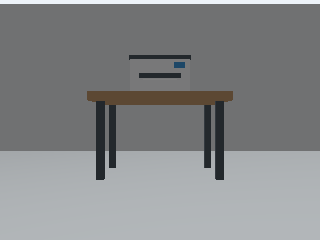
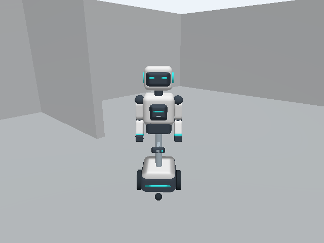

# Gazebo office environment

The office world includes a wheeled humanoid with rendered RGB-D, lidar,
wheel odometry and TF. Run sensor checks, AMCL/Nav2 navigation, or the live
camera → memory → semantic command → Nav2 → visual arrival test. No physical robot
is required. Sensor and navigation checks need no API key; the complete perception
test uses hosted models. All world geometry is bundled; no CLIP weights are downloaded.

For interactive multi-goal instructions, use the separate
[mission reference profile and walkthrough](reference-deployment.md). The existing
`check-pipeline` test remains a single-goal test; `start-nav` alone does not start PlaceCell
or its planning agents.

The [multi-product evaluation](product-missions.md) adds a microwave and fire
extinguisher, scores ordered and repeated visits, and records the current live-model
failures as well as the working stages. Its opt-in world leaves the default scene unchanged.



The image above is an actual 320 × 240 camera capture from the original headless smoke test.



The default robot has a rounded white shell, dark visor, cyan indicators and tucked
arms on a differential-drive base. It is about 1.25 m tall and stays within the
0.48 × 0.46 m navigation footprint. Its arms and head are fixed; manipulation is
not implemented. RGB-D remains at 0.53 m and lidar at 0.38 m, with the same wheel
radius, wheel spacing, topics and optical frames. The upper body has mass and a
conservative collision volume. The authored mesh is bundled and can be regenerated
with `python3 simulation/scripts/make_robot_mesh.py`; no external robot assets are needed.
The simulation gives RGB-D callbacks up to one wall-clock second to pair under
software rendering (`rgbd_wait_s`); the 80 ms capture-time skew limit remains unchanged.
The camera bridge and application use reliable RGB, depth and calibration delivery
(`rgbd_reliable: true`) to avoid losing one half of a capture. Hardware deployments
default to sensor-data QoS; enable reliable subscriptions only with a compatible
publisher. Capture timestamps and freshness limits still apply.

The [humanoid validation report](simulation-humanoid-validation.json) records the
2026-09-16 sensor and live navigation checks. From 5.71 m away from the remembered
printer, the command `go to the printer` selected an object approach from visual
memory. The robot drove 3.98 m, verified the printer on arrival and updated the same
object from revision 2 to 3. This used a published text command and hosted models;
microphone input and arm motion were not tested.

[Watch the 49-second humanoid navigation recording](assets/wheeled_humanoid_printer.mp4).
The video shows the published command, the Gazebo overview, the robot's camera,
navigation status and the memory update. Playback uses simulation time; learning
the printer and driving to the departure position happen before recording begins.

The navigation map is generated from static collision geometry at lidar height.
AMCL receives an initial pose estimate with covariance, then computes localization
from actual simulated scans and odometry. The simulator requests fresh AMCL laser
updates while stationary; it never replaces localization with ground-truth TF or
restamps old covariance. Perception receives pixels, not simulator object labels.

## Test the complete pipeline

To record a command-and-response demonstration without an API key:

```bash
./simulation/sim build
./simulation/sim start-nav
./simulation/sim record-commands
```

This starts the real Placecell ROS node and publishes `go to 1.0, 0.0`, followed
by `go to -1.0, 0.3, 3.14`, to `/placecell/command`. Each command must succeed
through Placecell's parser, localization gate and Nav2 client, with the robot
moving at least 0.5 m and arriving within 0.15 m of the requested position. The
last number is yaw in radians. The video shows commands being sent, their status,
an overhead Gazebo camera and the robot's front camera. The overhead camera is
only for viewing and is never used for localization or memory. Artifacts are
saved under `simulation/artifacts/record-commands-*/`.

This demonstration uses coordinate destinations with visual memory disabled;
it does not exercise object-name retrieval. Use the live test below to record
`go to the printer` resolved from observed visual memory.

```bash
./simulation/sim build
./simulation/sim start-nav
./simulation/sim check-nav
```

This checks the production localization gate and sends real Nav2 action goals,
including translation and rotation. It uses the planner, controller, costmaps,
velocity smoother and collision monitor. Use a fresh world for each independent run.

For the live model test, provide `OPENROUTER_API_KEY` in your shell without committing
it to a file. The launcher forwards it only to the test process:

```bash
read -rs -p 'OpenRouter API key: ' OPENROUTER_API_KEY; echo
export OPENROUTER_API_KEY
./simulation/sim start-nav
./simulation/sim check-pipeline
unset OPENROUTER_API_KEY
```

The test uses `google/gemini-embedding-2` for image/text vectors and
`google/gemini-2.5-flash` for captions and destination verification, and
`google/gemini-3.1-flash-lite` for object learning. The mission profile uses
`google/gemini-2.5-flash-lite` for arrival detection and comparison to fit its capture-age
bound. These are paid API
calls. It starts a fresh Placecell database and:

1. Drives to a viewpoint and waits for a visually detected printer with trustworthy
   RGB-D coordinates in durable memory.
2. Drives away and faces the other room, so the printer is out of view.
3. Publishes `go to the printer` to `/placecell/command`.
4. Requires retrieval, visual destination verification, a real Nav2 trip of at least
   one metre, and a fresh object identity match after arrival.
5. Requires a new sighting of that same object after arrival, then checks that an
   unknown destination is rejected without movement.

Every run produces a `simulation/artifacts/check-pipeline-*/report.json`, node log,
RGB-D recording, retained keyframes and database. Failed runs save their evidence
and exit nonzero. The test stops its Placecell process, so it does not keep making
API calls afterward. The Gazebo environment remains available until `simulation/sim stop`.

Add `--record-video` to either `check-nav` or `check-pipeline` to save a silent
`walkthrough.avi` in that run's artifact directory. It combines actual RGB camera
frames with the localized robot pose, travelled path, test phase and navigation
status. A `video_frames.jsonl` file records timestamps and telemetry for captured frames.
The video plays at five frames per simulation second, with a three-second final
still; it is not a wall-clock screen capture. The navigation-only recording is
explicitly labelled as having no model calls. No additional models are downloaded.

For a focused video of a semantic command from farther away, use a fresh world
and the same live API-key setup:

```bash
./simulation/sim start-nav
./simulation/sim check-pipeline --record-command-video --departure-x -3.0 --departure-y -0.5
```

The robot first learns the printer from RGB-D observations and drives to the
specified departure position, facing away. Recording starts there, just before
publishing `go to the printer`; no coordinates or named-place shortcut are sent
with that command. The video shows the overhead Gazebo view, robot camera,
retrieved approach goal, trip distance, and fresh visual arrival check. It ends
after the same object's memory is updated. The separate unknown-destination
check still runs afterward and is included in the JSON report. Preparation
movement is excluded from the video's distance counter.

For browser-compatible H.264 output, convert the saved recording with host FFmpeg:

```bash
ffmpeg -i /path/to/run/walkthrough.avi -c:v libx264 -crf 20 \
  -pix_fmt yuv420p -movflags +faststart /path/to/run/walkthrough.mp4
```

The command is text at the speech-transcript boundary; microphone capture and speech
recognition are not exercised. This is a bounded office integration test, not a
long-duration reliability or real-robot validation. The similarity threshold in
`simulation/config/placecell.yaml` is calibrated on this scene's crops and needs
evaluation on different recordings. Moving-object and local-search scenarios need
separate runs. Do not drive with the keyboard while an automated check is active.

### Recorded result: 16 September 2026

The live office test passed using the models above. The semantic command produced a
1.95 m Nav2 trip to a collision-checked object approach; fresh appearance and geometry
matched the saved printer. Its identity stayed the same while its revision advanced
from 1 to 4. Five scene memories, each with image and caption vectors, survived a
database reopen. The unknown destination returned `not_found` with 0 m movement.
The [machine-readable result](simulation-validation.json) records the checks and limits.

The run also exposed and fixed TF callback starvation, RGB-D delivery ordering,
crop-only verification losing scene context, and identity duplication when a detector
changed its label. The automated suite passed 660 tests with 95.20% coverage. A
non-fatal ROS `Destroyable` warning remains during shutdown; the test exited successfully
and the persisted database was reopened and checked afterward.

The subsequent command-video run started 5.72 m from the remembered printer,
facing away. `go to the printer` resolved from visual memory and produced a
3.95 m trip to an object approach, followed by a fresh visual match. The same
printer advanced from revision 1 to 3; six scene-vector rows and the object update
survived reopening the database. The 57-second recording covers the command
through verified arrival and the memory update. Its
[validation record](simulation-command-video-validation.json) captures the result.
The printer fixture now includes a visible paper feed, output page and contrasting
tray: the simpler fixture was initially classified as a box. Perception still uses
only camera pixels, without simulator object names or coordinates.

## Start on Linux with Docker

Install Docker Engine with the Compose v2 plugin. From the repository root:

```bash
./simulation/sim build
./simulation/sim start
./simulation/sim check
```

The first build downloads ROS 2 Jazzy, Gazebo Harmonic and their dependencies and needs
several gigabytes of disk space. Later builds reuse Docker's layers. ROS/Gazebo run
inside the container; no host ROS installation is necessary. This uses the official
[Jazzy/Harmonic pairing](https://gazebosim.org/docs/harmonic/ros_installation/).
The image uses software rendering and a virtual X display by default, so the headless
test does not require a passed-through GPU or desktop session. Performance depends on
CPU resources; sensor rates are specified in simulation time.

The smoke test **moves the simulated robot** a short distance and turns it. Run it on
a freshly started world with no concurrent keyboard controller. It checks:

- An advancing simulation clock and wheel odometry.
- Nonblank 640 × 480 RGB and aligned floating-point depth from one RGB-D sensor.
- Matching capture stamps, optical frame and valid CameraInfo through Placecell's
  actual `aligned_snapshot` validator.
- A 360-sample laser scan and the sensor TF chain, including the optical-axis rotation.
- Forward motion, rotation and the velocity watchdog's stop after command silence.

It writes `simulation/artifacts/camera.png` and `simulation/artifacts/report.json`.
These files are ignored by Git. To inspect sensors without moving:

```bash
./simulation/sim check --sensors-only
```

Use `./simulation/sim logs` to follow startup or failure logs, and
`./simulation/sim stop` to stop and remove this environment's container. Starting it
again resets the office. This does not stop other Docker projects.

## Open the 3D view and drive

On a Linux X11 or XWayland desktop with `DISPLAY` set and the host `xauth` utility:

```bash
./simulation/sim gui
```

This recreates the simulation with the Gazebo desktop window and stays in the foreground.
It passes a temporary display cookie and mounts the X socket read-only; it does not
disable X access control. Ctrl+C closes the environment and removes the temporary cookie.
Native Wayland without XWayland and remote desktops without an X display should use
headless mode. Docker Desktop on macOS/Windows is not covered by the GUI launcher.

In a second terminal:

```bash
./simulation/sim teleop
```

Focus that terminal. Use `i` for forward, `,` for reverse, `j`/`l` for turning and `k`
to stop. The keyboard publisher sends a command for each key event; hold a key to use
your terminal's key repeat. An independent watchdog stops after 0.5 seconds without
a command and limits forward speed to 0.35 m/s and turning to 0.8 rad/s. Its
timer uses wall time, including while Gazebo is paused. This is manual driving: lidar
is published, but keyboard commands go directly to the bounded command guard. Autonomous
Nav2 commands use Nav2's collision monitor before reaching that same guard.

## World and interfaces

The office is 10 × 8 m with an open passage, a printer on a desk, a workstation, chair
and bookshelf. The robot starts at the origin facing the printer. The objects use
simple authored geometry. The recorded printer trip exercises recognition in this scene;
it is not an accuracy benchmark across environments.
Object model names are never supplied to perception as detection results.

ROS topics inside the container are:

- `/clock`: `rosgraph_msgs/msg/Clock`.
- `/cmd_vel`: manual `geometry_msgs/msg/Twist` input to the watchdog.
- `/sim/cmd_vel`: bounded watchdog output bridged to the simulator.
- `/odom`: `nav_msgs/msg/Odometry`, from `odom` to `base_footprint`.
- `/tf`, `/tf_static`, `/joint_states`: the robot and sensor transforms.
- `/scan`: `sensor_msgs/msg/LaserScan`, frame `laser_frame`, 10 Hz target.
- `/camera/color/image_raw`: `sensor_msgs/msg/Image`, `rgb8`, 5 Hz target.
- `/camera/aligned_depth_to_color/image_raw`: `sensor_msgs/msg/Image`, `32FC1` metres.
- `/camera/color/camera_info`: `sensor_msgs/msg/CameraInfo` for that same optical image.

RGB, depth and calibration use `camera_optical_frame`. The sensor's local viewing axis
and ROS optical convention are connected by the robot description. The camera is
0.53 m above the base footprint and points forward. The bridge configuration follows
the official [ROS/Gazebo bridge](https://gazebosim.org/docs/harmonic/ros2_integration/).

For inspection, open a sourced terminal in the container:

```bash
./simulation/sim shell
ros2 topic list
ros2 topic hz /camera/color/image_raw
ros2 run tf2_ros tf2_echo odom camera_optical_frame
```

The default network is isolated from host ROS discovery, uses ROS domain 77 and exposes
no ports. It does not mount robot devices, host credentials, the Docker socket or the
working tree. The GUI mode adds only display access. Applications that join this
simulation should run inside its container or an explicitly configured simulation network.

## Development and regression checks

World geometry is in `simulation/worlds/office.sdf`; the robot and both sensor definitions
are in `simulation/models/robot/robot.urdf.xacro`. The Xacro is the single source for
Gazebo spawning and `robot_state_publisher`. Edit these files, rebuild and restart:

```bash
./simulation/sim build
./simulation/sim stop
./simulation/sim start
./simulation/sim check
```

The `simulation` GitHub workflow runs the sensor checks and a fresh AMCL/Nav2 route
when simulator files or the depth interface change, and supports manual runs. It
uploads camera images, reports and simulator logs for inspection. Hosted-provider
tests are opt-in and are not run by pull requests. Python tests still run separately in the
existing CI workflow. Container dependency versions can change when rebuilding against
updated package repositories; retain the tested image digest for an exact deployment.

Navigation parameters are in `simulation/config/nav2.yaml`; they override the installed
Jazzy defaults. AMCL noise and Nav2 stopping tolerances are chosen for this simulation,
not physical hardware. `simulation/config/placecell.yaml` configures the live providers,
bounded sampling and checked object approaches. For a desktop view with navigation,
run `SIM_NAVIGATION=true ./simulation/sim gui` instead of `start-nav`.
